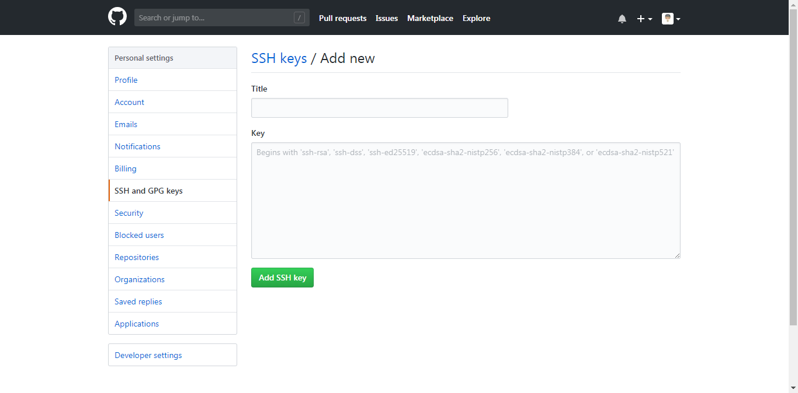
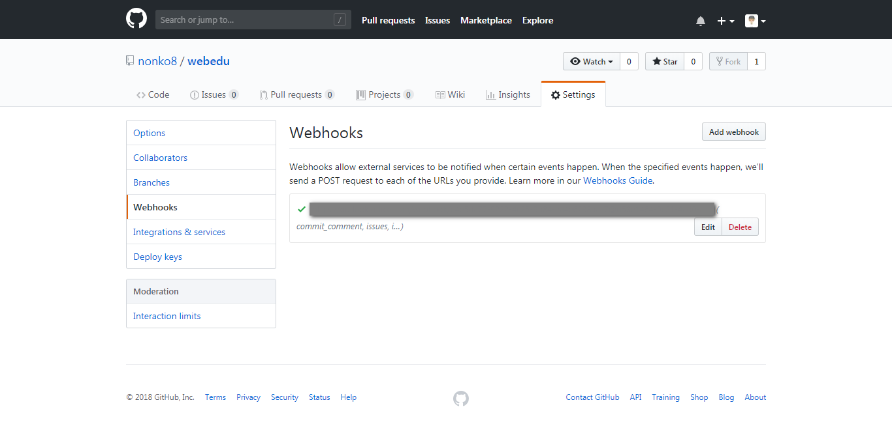
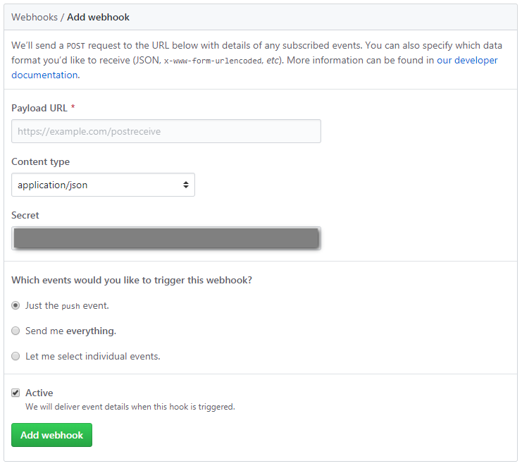
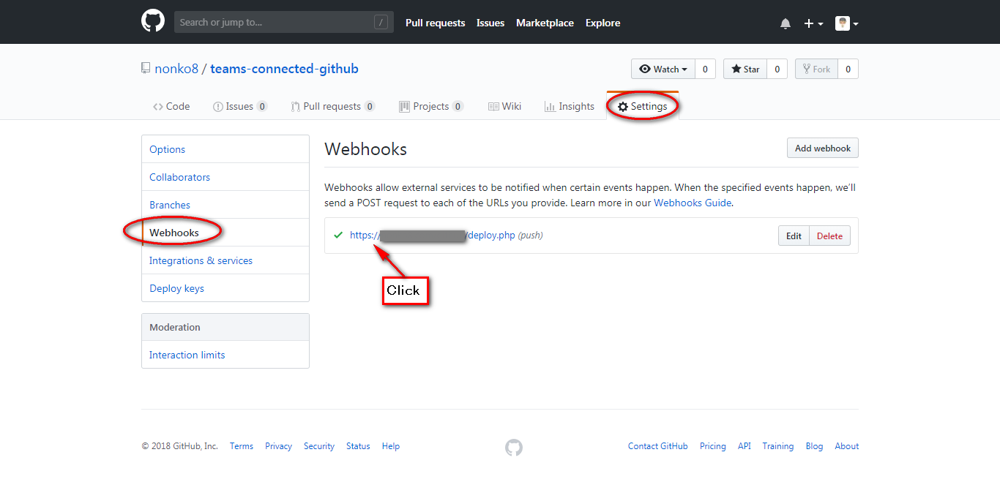
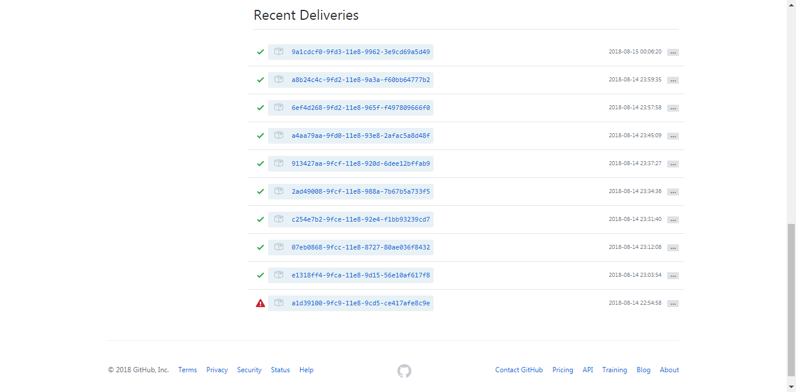

# GitHub で変更が入ったら、自動でサーバーにデプロイする
GitHub へ push されたら、自動的に実行環境デプロイデプロイすることができるようです。

実現方法はいくつかあるようなので、備忘録としてまとめてみます。

1. GitHubのwebhook機能を使った連携

## 1. GitHubのwebhook機能を使った連携

大まかな流れは以下の通り
- GitHubのPush通知を受け取るスクリプトの作成・配置
- デプロイ先のサーバでSSHキーを作成
- GitHubにSSHキーを登録
- GitHubでwebhookの設定

### GitHubのPush通知を受け取るスクリプトの作成・配置
webhookで呼び出されるスクリプトを作成する。
以下、PHPでのサンプルコード
```php
[deploy.php]
<?php

// 設定
require_once(dirname(__FILE__).'/config.php');

$header = getallheaders();
$post_data = file_get_contents( 'php://input' );
$hmac = hash_hmac('sha1', $post_data, $SECRET_KEY);
if ( isset($header['X-Hub-Signature']) && $header['X-Hub-Signature'] === 'sha1='.$hmac ) {
    $payload = json_decode($post_data, true);  // 受け取ったJSONデータ

    foreach ($COMMANDS as $branch => $command) {
      // ブランチ判断
      if($payload['ref'] == $branch){
        if($command !== ''){
          // コマンド実行
          exec($command);
          file_put_contents($LOG_FILE, date("[Y-m-d H:i:s]")." ".$_SERVER['REMOTE_ADDR']." ".$branch." ".$payload['commits'][0]['message']."\n", FILE_APPEND|LOCK_EX);
        }
      }
    }//foreach


} else {
    // 認証失敗
    file_put_contents($LOG_FILE_ERR, date("[Y-m-d H:i:s]")." invalid access: ".$_SERVER['REMOTE_ADDR']."\n", FILE_APPEND|LOCK_EX);
}

//http://qiita.com/oyas/items/1cbdc3e0ac35d4316885
//https://yosiakatsuki.net/blog/github-auto-deploy/
?>
```
`deploy.php` で読み込ませる設定ファイルを以下のように作成する
```php
[config.php]
<?php
  // 設定
  $LOG_FILE = dirname(__FILE__).'/hook.log';
  $LOG_FILE_ERR = dirname(__FILE__).'/hook-error.log';
  $SECRET_KEY = 'secretkey';

  // 実行するコマンド
  $COMMANDS = array(
                'refs/heads/develop'=>'',//developブランチ
                'refs/heads/master'=>'' // masterブランチ
              );

 ?>
```
|変数名|説明|
|--|--|
|$LOG_FILE|ログファイル名|
|$LOG_FILE_ERR|認証失敗時のログファイル名|
|$SECRET_KEY|GitHubのwebhookで設定するSecretキーをそのまま設定|
|$COMMANDS|key:ブランチ,value:コマンド のペア（配列）|


### SSHキーを作成
デプロイを自動で行うためにデプロイ先のサーバから `git pull` などのgitコマンドを実行するために、デプロイ先のサーバでSSHlキーを作成しておく。

SSHキー作成コマンド
```bash
ssh-keygen -t rsa
```

### GitHubにSSHキーを登録
SSHキーが生成出来たらGitHubに公開鍵を登録するため、以下のコマンドで公開鍵の中身を表示させて、コピーしておく。
```bash
cat /home/[サーバーID]/.ssh/id_rsa.pub
```
GitHubの設定画面を開き、「SSH and GPG keys」の画面を表示して、コピーしたSSHキーを登録する。


登録が完了したら、以下のコマンドで接続確認を実施してみる。
```bash
ssh -T git@github.com

The authenticity of host 'github.com (xxx.xxx.xxx.xxx)' can't be established.
RSA key fingerprint is SHA256:xxxxxxxxxxxxxxxxxxxxxxxxxxxxxxxxxxxxxxx.
Are you sure you want to continue connecting (yes/no)? yes
Warning: Permanently added 'github.com,xxx.xxx.xxx.xxx' (RSA) to the list of known hosts.
Hi nonko8! You've successfully authenticated, but GitHub does not provide shell access.
```
「You've successfully authenticated」の応答があればOKのようです。

#### SSHキーに名前をつけて生成した場合
SSHキーを生成する際にデフォルトの「id_rsa」ではなく、名前をつけた場合は、.sshディレクトリ内にconfigファイルを作成して接続先情報を書いておく必要がある。
```bash
[config]
Host github
HostName github.com
IdentityFile ~/.ssh/id_rsa_github #生成した鍵ファイル名
User git
```
configファイルを作成したら、以下のように接続を確認。
```bash
ssh -T github
```

### GitHubでwebhookの設定
webhookを設定するリポジトリの[Settings]→[Webhooks]を開いて「Add webhook」からwebhookを追加。


|項目|説明|
|--|--|
|Payload URL|先に配置したdeploy.phpまでのURLを入力|
|Content type|application/jsonを選択|
|Secret|先に作成した`config.php`の$SECRET_KEYに入力するパスワード的なもの|
|Which events would you like to trigger this webhook?|「Just the push event.」でプッシュ時に実行されるようにする|


### 動作確認
以下の設定が完了したら、実際にローカル環境からGitHubにPushしてみよう。
- GitHubのPush通知を受け取るスクリプトの作成・配置
- デプロイ先のサーバでSSHキーを作成
- GitHubにSSHキーを登録
- GitHubでwebhookの設定

GitHubでwebhookが実行されたかは、GitHubのwebhookの設定画面で確認できる。

設定した該当のwwebhook用URLリンクをクリック。


画面を下にスクロールすると、「Recent Deliveries」の欄が表示されて、リンクをクリックすると

- webhookが実行されたか
- そのような内容でリクエストされたか
- レスポンスのHTTPコードは何か

といったようなことが確認できる。

