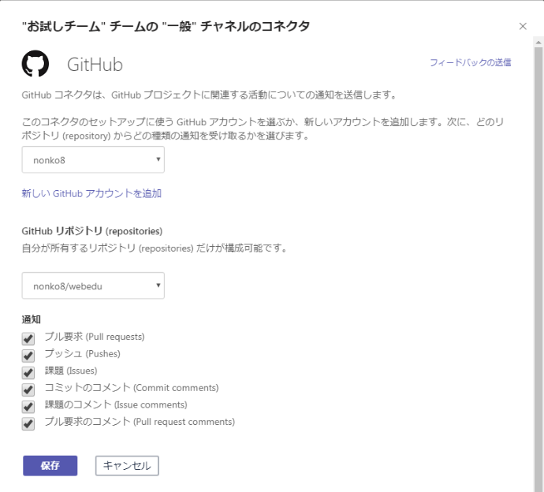
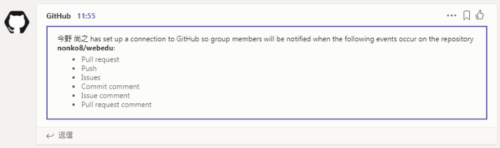
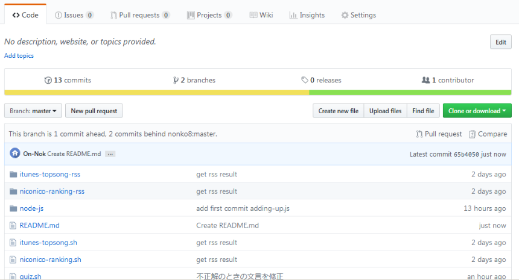
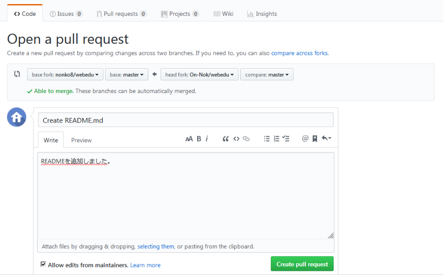

# Teams のコネクタで GitHub を使ってみた
## 構成
1. Teams のコネクタから GitHub を選択し「構成」をクリック
2. GitHub のアカウントでサインイン
3. Teams で利用するリポジトリを選択
    - 構成はリポジトリ単位になる。複数リポジトリを Teams のひとつのチームで扱うには、リポジトリ分「構成」を行う
    - どういった場合に通知を受けるかをチェックする
    

    - うまく連携できるとGitHubからTeamsへメッセージが送られてくる
    

## GitHubでプルリクしてみる

1. 自分のリポジトリにFork

2. コード修正

3. 「New pull request」
    

4. マージ先のリポジトリを確認してコメントを記入し「Create pull request」
    

## GitHubのマージについて
- 引用サイト  
[GithubでのWeb上からのマージの仕方3種とその使いどころ](https://qiita.com/ko-he-8/items/94e872f2154829c868df)
 
 
<blockquote>
GithubでWebのGUIからマージしようとする「Create a merge commit」、「Rebase and merge」、「Squash and merge」の選択肢があります。この記事では、それぞれのマージの動作の違いと使いどころをまとめました。

### GithubのWebからのマージ
GithubでPull requestをいただいてマージしようとすると以下の3種類が表示されます。

- Create a merge commit
- Rebase and merge
- Squash and merge

この動作の違いをまとめました。

### 前提
説明するに当たりマージする前の状態を以下の状態として進めていきます。これはAのリポジトリからBがforkして、2つコミットした後にAにPull requestを出して、取り込まれるのを待っている状態だと思ってください。  
　また、BがY、Zの変更をしている間にAにコミットXがあったが、X、Y、Zは別ファイルの編集(コンフリクトしない編集)ということにします。

この状態ではXからはPull requestが1件来ていてコンフリクトが起きていないので3種類の選択肢からどれかを選べばBの変更をマージできます。

### Create a merge commit
「Create a merge commit」を選んだ場合、動作としてはgit `merge --no-ff` でのマージになり以下のようになります。

新たにAのブランチ上にマージコミットMが作成されます。このMには変更情報は含まれず、実際の変更内容としてY、ZのコミットがコミットIDそのままで取り込まれます（正確に述べるとXとZを親に持つコミットMが作成されAのHEADがMになる）。また、マージコミットMのAuthorはAになります。  

このマージ方法の良いところとしては、
- 何をマージしたか記録が残る（マージコミット）
- マージ前のブランチがそのまま残るので変更を細かく追いやすい
- Bが消えてもY、Zの履歴はAに残る

一方、悪いところとしては、
- Github上のNetworkやgit log --graphで見たときに複雑になる。
- git resetで戻るときに注意が必要

等があります。

### Rebase and merge
「Rebase and merge」を選んだ場合以下のようになります。

動きとしては、まずはrebaseが行われるので以下のようにBのブランチの分岐先がAの先頭Xからの分岐に代わります。

その後、fast-forwardマージが行われXの先からY、Zと続くようになり最初の図の状態になります。この時、新しくマージコミットは作られません。また、rebaseは実際にBに対して行われるわけではないのでブランチBに変更はありません。また取り込まれたY・ZのAuthorはBのままになります。

このマージ方法の良いところとしては、
- 履歴が一本で見やすい

一方、悪いところとしては、
- mergeできてもrebaseできないため実行できないことがある

### Squash and merge
「Squash and merge」を選んだ場合、動作としては `git merge --squash` の動作になります。

この方法ではブランチBで行った変更YからZをまとめたマージコミットSが新たに作られAに追加されます。この時、マージコミットSのAuthorはBになります。また、「Create a merge commit」とは異なりマージ元のブランチBとの関係は残りません。

このマージ方法の良いところとしては、
- 何をマージしたか記録が残る（マージコミット）
- コミットをまとめられる

一方、悪いところとしては、
- まとめる前のコミットには戻れない

### 比較
||Create a merge commit|Rebase and merge|Squash and merge|
|:--|:--|:--|--|
|マージコミット|あり|なし|あり|
|マージコミットのAuthor|マージ先|-|マージ元|
|元のコミットログ|残る|残る|残らない|
|元ブランチとの関係|残る|残らない|残らない|

### 結局どうしたいか
これは開発チームの思想や開発の進め方で大きく変わってくるとは思いますが、一旦、私がよく使う以下のブランチが存在するリポジトリでの話で進めます。

- master
- develop
- topic_branch

これらのブランチを使って開発していく上で

- master
    - 常にきれいなcommit logで一本道にしたい
    - 基本的にdevelopブランチ以外をマージしない
    - developのどこまでがマージされたかわかるようにしたい
    - マージするたびにバージョンが上がる(ex. 1.0.12→1.0.13)
- develop
    - topic_branchや外部からのpull_requestはここに受ける
    - ここもきれいなcommit logを保ちたい
- topic_branch
    - developに取り込んだのち削除
    - 開発速度優先で細かくcommitしコミットメッセージもある程度適当

というような考えで開発を進めたいと思います。  

この場合mergeは

- develop→master
- topic(pull request)→develop

以外は基本的に行わないことになります。  

先に結論から述べると

- develop→master : Create a merge commit
- topic→develop : Squash and merge  

が良いと考えます。

　まずdevelop→masterの場合ですが、これは「Create a merge commit」にすべきだと思います。これは単純な話で、他のマージ方法でマージした後developに変更を加えてもう一度マージするとおそらくコンフリクトを起こします。そのため、「Create a merge commit」にすべきです。

　一方topic(pull request)→developの場合は、微妙なところですが「Squash and merge」を使いたいと思います。基本的にtopicブランチは取り込んだ後は削除するという点と、topic_branchのコミットログは汚くなりことを許容したいという思いと、pull requestでもチームのcommitの規則を守ってもらうようにするのは大変ですので、そのため変更を一つのコミットにまとめて取り込める(汚いログを残さない)Squash and mergeを使いたいと思います。ただし、この場合topicブランチがあまり大きくならない前提です。大きな機能追加で、ブランチも大きくなる場合は開発中からcommit logにも気を使い、最後はRebase and mergeでコミットログを残して取り込むのが良いのではないでしょうか。
</blockquote>
