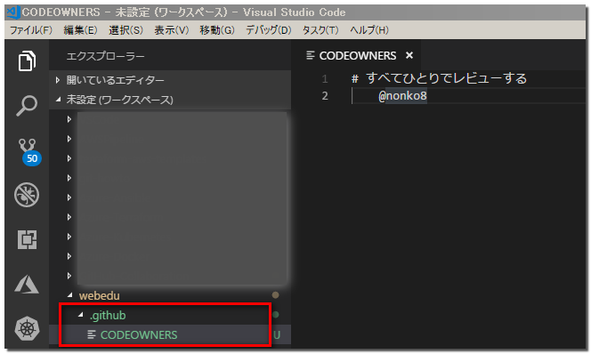
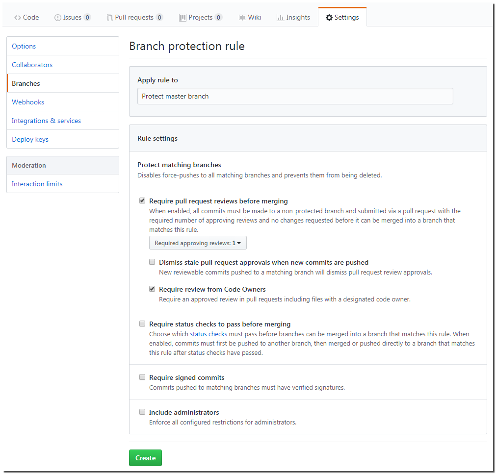
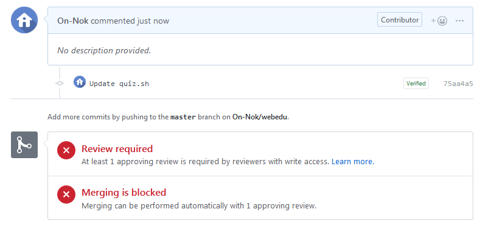
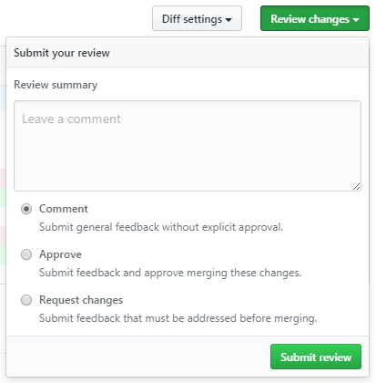

# プルリクエストに対してレビューとテストを必須にする

## 目指すところ
- masterブランチにプルリクされたら、レビュー担当者にレビューのリクエストが飛ぶようにする
- 同時に、Jenkinsでテストも実行される
- レビューとテスト、両方OKでないとmasterブランチにマージできないようにする

## GitHubでレビュー必須にする
レビューを必須にするのは、GitHubの設定変更だけで対応可能。  

> [公式ドキュメント（英語）](https://help.github.com/articles/about-codeowners/)

コード所有者を追加するブランチのリポジトリのルート、docs /、または.github /ディレクトリにCODEOWNERSという名前の新しいファイルを作成するとのこと。

各CODEOWNERSファイルは、リポジトリ内の1つのブランチのコード所有者を割り当てられる。なので、いろいろなブランチに異なるコード所有者を割り当てることが可能。  

コード所有者がレビュー要求を受け取るには、CODEOWNERSファイルがプル要求のベースブランチにある必要がある。たとえば、リポジトリのgh-pagesブランチ上の.jsファイルのコード所有者として@octocatを割り当てると、ヘッドブランチとghの間で.jsファイルを変更したプルリクされると、@octocatはレビュー要求を受け取る。

> [CODEOWNERS サンプル](CODEOWNERS.sample)

CODEOWNERSファイルをmasterブランチにコミットしてプッシュ。

その他、プルリクする必要のないファイルは、いまのうちにまとめてプッシュしておきましょう。
設定をしてしまった後では、masterへの直接プッシュはできなくなるので。（設定解除すればできますが）

## masterブランチをプロテクトする

GitHubのリポジトリのページへ遷移し、

1. `Settings`　→　`Branches` とクリック
2. 「`Branch protection rules`」 という欄があるので、「`Add rule`」ボタンをクリック
3. 「`Require pull request reviews before merging`」にチェック
4. 「`Require review from Code Owners`」にチェック
5. 画面下の「`Create`」をクリック

これで、masterブランチにプルリクされると、コードオーナーにレビューがリクエストされ、そのオーナーのうちの誰かがレビュー・承認しない限り、プルリクをマージできなくなる。

プルリクすると、こんな感じになる。

プルリクの画面で該当のプルリクを表示すると、「`Add your review`」というリンクが表示されているので、リンクをクリックすると、以下のようなレビュー結果を入力できるウィンドウが表示される。

|項目名|説明|
|--|--|
|Comment|コメントだけする|
|Approve|承認|
|Request changes|却下|

承認すると、マージできるようになる。

## 自動テストも必須にする

今回はJenkinsを使って自動テストの実装をしてみることに。ここからは、GitHubとJenkinの両方に設定が必要となる。

### 1. botアカウントの作成 ＠ GitHub
- JenkinsがアクセスするためのbotアカウントをGitHubに作成。
- リポジトリの「`Settings`」から、「`Collaborators`」メニューを選択。
- 作ったbotアカウントを `collaborator` に追加。
- botアカウントにinvitationメールが送られるので、そっち側でログインし直してaccept、ログアウトして、元のアカウントでログインし直す。

### 2. Webhooksの設定 ＠ GitHub
- リポジトリの「`Settings`」から、「`Webhooks`」メニューを選択。
- 画面右上の「`Add webhook`」ボタンをクリック。
- (最低限)以下の項目を入力。

> |項目名|説明|
> |--|--|
> |Payload URL|"http://[Jenkinsサーバ]/ghprbhook/"を入力|
> |Secret|適当な文字列を入力(※1)|
> |Which event would you like to trigger this webhook?|"Let me select individual events."を選択|
> |Pull request|チェックする|
> |Push|チェックを外す|

※1：Secretの文字列を「パスワード」として、Jenkins側にも設定すれば、ユーザIDとパスワードをURLに直書きする必要はなくなる。  
"http://[ユーザID]:[パスワード]@[Jenkinsサーバ]/ghprbhook/"のような感じにしなくても良くなるということ。  
他には、パスワードの代わりにトークンを用いる方法もあるようだが、詳しくは [こちらの記事](https://developer.aiming-inc.com/infra/jenkins-github-webhook-collaboration/) を参照。

- 最後に「`Add webhook`」ボタンをクリックして webhook を作成

### 3. botアカウントの設定 ＠ Jenkins
- ますは、以下のプラグインをインストール
    - Git plugin
    - GitHub plugin
    - GitHub Pull Request Builder plugin  
    ※「Jenkinsの管理」→「プラグインの管理」からインストール
- GitHubで作成したbotアカウントをJenkins側に設定
    - 「Jenkinsの設定」→「システムの設定」を選択し、遷移した画面の「GitHub Pull Request Builder」欄で以下を設定

> |項目名|説明|
> |--|--|
> |GitHub Server API URL|"https://api.github.com" と入力|
> |Credentials|1. 「追加」ボタン→「Jenkins」をクリック 2. 現れたダイアログの「ユーザー名」「パスワード」に、GitHubで作成したbotのアカウント名とパスワードを入力、「追加」ボタンをクリック 3. 「Shared Secret」にGitHubで設定した「Secret」の文字列を入力 4. プルダウンで、botアカウントが選べるようになるので選択。 5. 「Test Credentials...」で、GitHubに接続できるか試せる。|
> |Description|自分で識別できるような文字列を入力|

- 最後に、「保存」ボタンをクリック。

### 4. ジョブの設定 ＠ Jenkins
※TODO：後ほど追記

### 5. プルリクしてみる ＠ GitHub
※TODO：後ほど追記

### 6. テストを必須にする ＠ GitHub
※TODO：後ほど追記

---
# 参考記事
- [GitHub + Jenkins で、全てのプルリクエストに対してレビューとテストを必須にする](https://qiita.com/bonotake/items/37fb3194c33f3ae3bbf0)
- [Pull Request Builder PluginをJenkinsに導入する](https://qiita.com/naotawool/items/e7fef0b2de7f070d891d)
- [GitHub Pull Request Builder Plugin の多すぎる設定項目を補足してみる](https://qiita.com/naotawool/items/e7fef0b2de7f070d891d)
- [Jenkinsでプルリクエストをビルドする](https://qiita.com/quattro_4/items/6b1962909ce868f12e5a)
- [gitbucketとjenkinsをGitHubPullRequestBuilderを使って連携する](https://qiita.com/hikaruworld@github/items/ae2cdc1904d7d35ef0b8)
- [About pull request reviews - GitHub User Documentation](https://help.github.com/articles/about-pull-request-reviews/)
